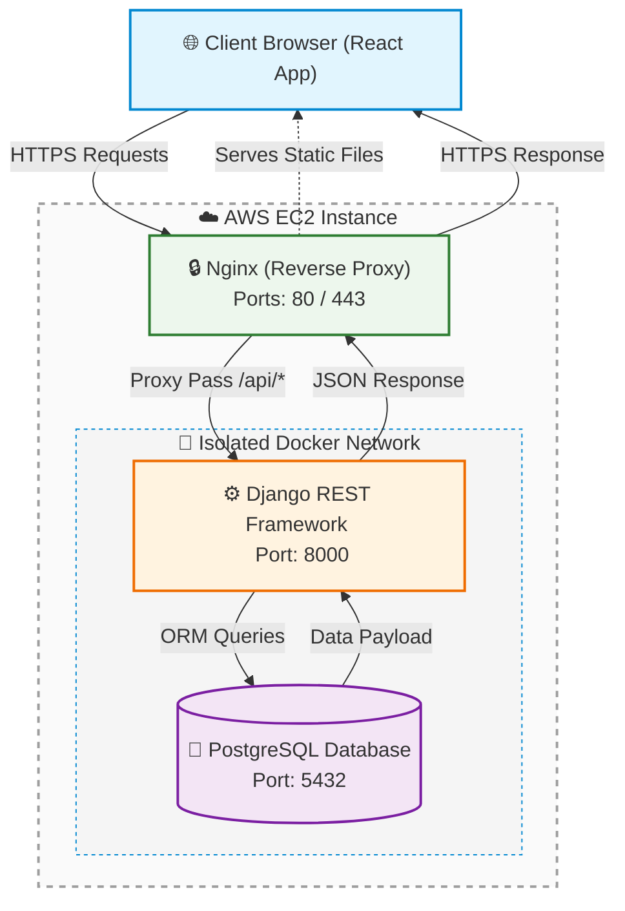

# JobTracker

A full-stack web application for managing your job search pipeline — track applications, monitor status changes, and stay organised throughout your career journey.

🌐 **Live Demo**: [jobtracker.miagamestudio.com](https://jobtracker.miagamestudio.com)

---

## Table of Contents

- [Overview](#overview)
- [Features](#features)
- [Tech Stack](#tech-stack)
- [Architecture](#architecture)
- [CI/CD Pipeline](#cicd-pipeline)
- [Project Structure](#project-structure)
- [Getting Started](#getting-started)
- [Environment Variables](#environment-variables)
- [API Endpoints](#api-endpoints)

---

## Overview

JobTracker solves a common problem for job seekers — keeping track of dozens of applications across multiple companies, stages, and timelines. Instead of managing spreadsheets, users get a clean interface to log applications, update statuses in real time, and search across their entire pipeline.

The project is built with a production-grade architecture: a Dockerized Django REST API behind a Gunicorn WSGI server, a React SPA served via Nginx, PostgreSQL for persistence, and Google OAuth for frictionless authentication — all deployed to AWS EC2 through an automated GitHub Actions CI/CD pipeline.

---

## Features

- **Google OAuth** — one-click sign-in via Google, no password required
- **Full CRUD** — create, view, edit, and delete job applications
- **Status Tracking** — move applications through stages: Applied → Interview → Offer → Rejected
- **Search & Filter** — find applications instantly by company, role, or status
- **Secure by default** — JWT authentication, CORS protection, HTTPS enforced via Nginx

---

## Tech Stack

### Backend

| Technology                        | Purpose                              |
| --------------------------------- | ------------------------------------ |
| **Django**                        | REST API framework                   |
| **Django REST Framework(DRF)**    | API serialization and authentication |
| **PostgreSQL 15**                 | Primary database                     |
| **Gunicorn**                      | Production WSGI server               |
| **django-allauth**                | Google OAuth integration             |
| **djangorestframework-simplejwt** | JWT token authentication             |
| **django-cors-headers**           | Cross-origin request handling        |

### Frontend

| Technology            | Purpose                             |
| --------------------- | ----------------------------------- |
| **React 18**          | UI framework                        |
| **JavaScript (ES6+)** | Primary language                    |
| **Vite**              | Build tool and dev server           |
| **Material UI (MUI)** | Component library and design system |

### Infrastructure

| Technology                  | Purpose                                             |
| --------------------------- | --------------------------------------------------- |
| **Docker & Docker Compose** | Containerisation and orchestration                  |
| **Nginx**                   | Reverse proxy, static file serving, SSL termination |
| **AWS EC2**                 | Cloud deployment                                    |
| **GitHub Actions**          | CI/CD pipeline                                      |
| **Playwright**              | End-to-end testing                                  |

---

## Architecture



### Core Engineering & Architectural Decisions

* **Nginx Reverse Proxy & Network Isolation:** To secure the production environment, only public HTTP/HTTPS ports (80/443) are exposed externally on the AWS EC2 instance. The Django REST API (port 8000) and the PostgreSQL database (port 5432) are fully isolated within a private, internal Docker bridge network. This prevents direct external access to backend endpoints and eliminates automated database scanning vectors.
* **Resource-Optimized CI/CD via Runner Bundling:** Executing memory-intensive operations like frontend compilation (`npm run build`) directly on micro-cloud instances frequently triggers Out-Of-Memory (OOM) kernels, causing server crashes. To optimize resources, production assets are fully compiled on the GitHub Actions runner environment and securely transferred via SSH pipelines. This keeps AWS EC2 memory utilization consistently under 40% during deployments and ensures zero-downtime upgrades.
* **Relational Integrity & Query Efficiency in PostgreSQL:** The domain model requires strict transactional logic for tracking nested job stages, interview dates, and company metrics. PostgreSQL was selected over a NoSQL alternative to enforce relational constraints, prevent orphaned records on cascade deletions, and leverage B-Tree indexing on highly queried fields (`company`, `status`, and `date_applied`) to optimize lookup performance as the data layer scales.
* **Federated Google OAuth Identity Management:** To lower user onboarding friction and eliminate password storage liabilities, the platform implements a federated OpenID Connect (OIDC) authentication pipeline via Google OAuth 2.0. The React client intercepts the public authorization flow, secures client-side routing, and securely exchanges the third-party token with the Django backend. The backend maps verified payloads to a custom `User` model, creating a unified authentication profile.
* **Stateless JWT Session Management & XSS Mitigations:** Core application authorization uses a dual-token architecture (short-lived access tokens paired with rotation-enabled refresh tokens) via Django REST Framework. To mitigate Cross-Site Scripting (XSS) risks, the implementation relies on React's automatic native JSX string-escaping layers to prevent token exfiltration via DOM injection, while access token lifetimes are strictly minimized to limit the blast radius of any potential token compromise.

---

## CI/CD Pipeline

```
Push to main
      │
      ▼
┌─────────────────────────────────────────┐
│  GitHub Actions                         │
│                                         │
│  1. Run Playwright E2E tests (native)   │
│     ├── PostgreSQL via services: block  │
│     ├── Django runserver (background)   │
│     ├── Vite dev server (background)    │
│     └── Playwright test suite           │
│                                         │
│  2. Build frontend (on runner)          │
│     └── npm run build → dist/           │
│                                         │
│  3. Deploy to EC2 (on success)          │
│     ├── Copy files + dist/ via SCP      │
│     ├── Write .env.production from      │
│     │   GitHub Secrets                  │
│     └── docker compose up --build       │
└─────────────────────────────────────────┘
      │
      ▼
   EC2 starts:
   ├── PostgreSQL container
   ├── Django + Gunicorn (migrate + collectstatic on start)
   └── Nginx (serves React + proxies API)
```

### E2E Tests

Tests run natively on the GitHub Actions runner — no Docker involved — for maximum speed:

- PostgreSQL via the Actions `services:` block
- Django started as a background process
- Vite dev server started as a background process
- Playwright auth state saved once and reused across all browser projects (Chromium, Firefox, WebKit)

---

## Project Structure

```
jobtracker/
├── .github/
│   └── workflows/
│       ├── e2e-ci.yml          # Playwright E2E tests on every PR
│       └── deploy.yml          # Build and deploy to EC2 on merge to main
│
├── backend/                    # Django project
│   ├── JWT/
│   │   ├── settings.py         # Environment-aware settings (dev/prod)
│   │   ├── urls.py
│   │   ├── asgi.py
│   │   └── wsgi.py
│   ├── users/
│   │   ├── migrations/
│   │   ├── admin.py
│   │   ├── models.py           # Custom User model
│   │   ├── serializers.py
│   │   ├── views.py            # GoogleLogin view, profile endpoints
│   │   └── urls.py
│   ├── jobs/
│   │   ├── migrations/
│   │   ├── models.py           # Job application model
│   │   ├── serializers.py
│   │   ├── views.py
│   │   └── urls.py
│   ├── docs/
│   │   ├── api_documentation.md
│   ├── manage.py
│   ├── requirements.txt
│   ├── .env.example            # template for required environment variables of backend
│   └── Dockerfile
│
├── frontend/                   # React + Vite project
│   ├── e2e/                    # Playwright specs
│   │   ├── .auth/
│   │   │   └── user.json       # saved auth state (git-ignored)
│   │   ├── auth.setup.ts       # login once, reuse session
│   │   └── jobs.spec.ts
│   ├── src/
│   │   ├── assets/
│   │   ├── components/
│   │   ├── pages/
│   │   ├── utils/              # api call function
│   │   ├── config.jsx
│   │   ├── app.jsx
│   │   └── main.jsx
│   ├── playwright.config.ts
│   ├── vite.config.ts          # dev proxy mirrors nginx routing
│   ├── .env.example            # template for required environment variables of frontend
│   ├── package.json
│   └── Dockerfile              # dev only — not used in production
│
├── nginx/
│   ├── Dockerfile              # copies pre-built dist/ into Nginx image
│   └── nginx.conf              # reverse proxy + static serving + security headers
│
├── docker-compose.yml          # base — shared by both environments
├── docker-compose.dev.yml      # local development overrides
├── docker-compose.prod.yml     # production overrides (Nginx, Gunicorn, no bind-mounts)
└── README.md
```

---

## Getting Started

### Prerequisites

- Docker and Docker Compose
- Node.js 20+ (for running Playwright tests locally)
- Python 3.11+ (for running Django natively)

### Local Development

```bash
# 1. Clone the repository
git clone https://github.com/NNNicoleLiu/JobTracker.git
cd jobtracker

# 2. Copy environment template and fill in values
cp backend/.env.example backend/.env.development
cp frontend/.env.example frontend/.env.development

# 3. Start the full stack
docker compose -f docker-compose.yml -f docker-compose.dev.yml up -d --build

# Frontend → http://localhost:5173
# Backend  → http://localhost:8000
# Admin    → http://localhost:8000/admin
```

### Running E2E Tests Locally

```bash
# Start just the database
docker compose -f docker-compose.yml -f docker-compose.dev.yml up db

# In a separate terminal — start Django
cd backend
python manage.py migrate
python manage.py runserver

# In another terminal — start Vite
cd frontend
npm run dev

# Run Playwright
cd frontend
npx playwright test

# View the HTML report
npx playwright show-report
```

---

## Environment Variables

### Backend

Copy `.env.example` to `backend/.env.development` and fill in the values.

```env
# Django
DJANGO_ENV=development
SECRET_KEY=your-secret-key
DEBUG=True
ALLOWED_HOSTS=localhost,127.0.0.1

# Database
POSTGRES_DB=jobtracker_db
POSTGRES_USER=postgres
POSTGRES_PASSWORD=yourpassword
POSTGRES_HOST=localhost
POSTGRES_PORT=5432

# Google OAuth
GOOGLE_CLIENT_ID=your-google-client-id
GOOGLE_CLIENT_SECRET=your-google-client-secret
GOOGLE_CALLBACK_URL=http://localhost:5173

```

### Frontend

Copy `.env.example` to `frontend/.env.development` and fill in the values.

```env
VITE_API_URL=http://0.0.0.0:8000
```

### Google OAuth Setup

1. Go to [Google Cloud Console](https://console.cloud.google.com)
2. Create a new project → APIs & Services → Credentials
3. Create OAuth 2.0 Client ID (Web application)
4. Add authorised origins: `http://localhost:5173`
5. Add authorised redirect URIs: `http://localhost:5173`
6. Copy Client ID and Secret into your `backend/.env.development`

---

## API Endpoints

All endpoints require JWT authentication except login/register.

### Auth

| Method | Endpoint         | Description        | Auth     |
| ------ | ---------------- | ------------------ | -------- |
| `POST` | `/auth/google/`  | Google OAuth login | Public   |
| `POST` | `/auth/logout/`  | Logout             | Required |
| `GET`  | `/auth/profile/` | Get current user   | Required |

### Jobs

| Method   | Endpoint     | Description           | Auth     |
| -------- | ------------ | --------------------- | -------- |
| `GET`    | `/jobs/`     | List all applications | Required |
| `POST`   | `/jobs/`     | Create application    | Required |
| `PUT`    | `/jobs/:id/` | Update application    | Required |
| `DELETE` | `/jobs/:id/` | Delete application    | Required |

### Job Status Values

```
applied     → Submitted application
interview   → Interview scheduled or completed
offer       → Received an offer
rejected    → Application rejected
withdrawn    → Application withdrawn
```
